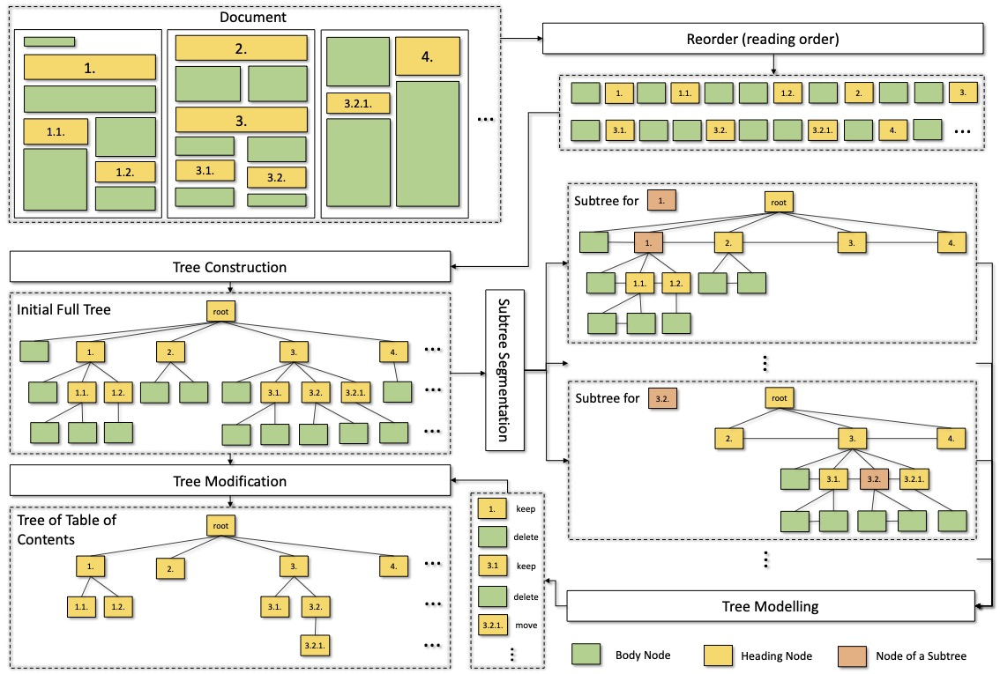

# A Scalable Framework for Table of Contents Extraction from Complex ESG Annual Reports

Resources for the paper: "A Scalable Framework for Table of Contents Extraction from Complex ESG Annual Reports"

## Introduction

> Table of contents (ToC) extraction centres on structuring documents in a hierarchical manner. Existing approaches have primarily focused on scientific papers, which are typically well-structured and concise. In this paper, we propose a new dataset, ESGDoc, comprising 1,093 ESG annual reports from 563 companies spanning from 2001 to 2022. These reports pose significant challenges due to their diverse structures and extensive length. To address these challenges, we propose a new framework for Toc extraction, consisting of three steps: (1) Constructing an initial tree of text blocks based on reading order and font sizes; (2) Modelling each tree node (or text block) independently by considering its contextual information captured in node-centric subtree; (3) Modifying the original tree by taking appropriate action on each tree node (Keep, Delete, or Move). This construction-modelling-modification (CMM) process offers several benefits. It eliminates the need for pairwise modelling of section headings as in previous approaches, making document segmentation practically feasible. By incorporating structured information, each section heading can leverage both local and long-distance context relevant to itself. Experimental results show that our approach outperforms the previous state-of-the-art baseline with a fraction of running time. Our framework proves its scalability by effectively handling documents of any length.



## Dependency

```
torch
torch-geometric
transformers
numpy
tqdm
fitz
anytree
sklearn
```

The tree edit distance similarity is computed with [apted](https://github.com/DatabaseGroup/apted) and is located at `cmm/tree_sim/apted`.

## ESG Dataset

Due to copyright concerns regarding ESG reports, we are unable to provide the original PDF files directly. However, we have endeavoured to simplify the process as much as possible.

Please download the necessary files and proceed with the following steps:

### Document and Report Information

Download data from [GoogleDrive](https://drive.google.com/file/d/1ARV0Ph7x-adratVVxw9aJjjitOBhqfqv/view?usp=sharing) and save as `data/data.zip`.

Unzip the `data/data.zip` to get:

```
├─ data/
    ├── document_info.jsonl
    ├── report_info
        ├──{doc_id}.jsonl
    ├── toc
        ├──{doc_id}.jsonl
```

`data/document_info.jsonl` encompasses pertinent details about a report, which includes:

| Key | Usage                                                             |
|---|-------------------------------------------------------------------|
|`doc_id`| Unique identifier for the report.                                       |
|`company_name`| Name of the company associated with the report.                            |
|`pdf_link`| Link for downloading the report's PDF file.                                |
|`pdf_metadata`| Metadata associated with the PDF file.                                     |
|`split_full`| Train/dev/test split for the experiments.                  |
|`split_partial`| Train/dev/test split for ESG Partial experiments. |
|`in_partial`| Indicates if the report is utilised as ESG Partial.                       |

Using the `doc_id`, one can locate the company details, block data, and table of contents information for a specific report.

`data/report_info/{doc_id}.jsonl` and `data/report_full/{doc_id}.jsonl` (to be generated in the subsequent step) store block-related information and are named according to the `doc_id`. The information contained within includes:

| Key | Usage                                                                                   |
|---|-----------------------------------------------------------------------------------------|
|`id`| Unique identifier for a block in this report, distinct from `doc_id`.                   |
|`size`| Font size.                                                                              |
|`font`| Font.                                                                                   |
|`color`| Colour, represented as int.                                                             |
|`position`| Coordinates of the top-left and bottom-right corners of the block's boundary. |
|`page`| Page number where the block is located.                                          |
|`xy_cut_sequence_number`| Sequence number for the xy-cut algorithm applied to this report.                     |
|`page_height`| Page height.                                                                            |
|`page_width`| Page width.                                                                             |
|`text`| Text content within the block.                                                             |

Note: The `text` key is absent in `data/report_info/{doc_id}.jsonl` but will be generated in `data/report_full/{doc_id}.jsonl` after downloading and processing the PDF files.

The file `data/toc/{doc_id}.jsonl` encompasses table of contents (ToC) information and is named based on the `doc_id`. The contained details are as follows:

| Key | Usage                                                                    |
|---|--------------------------------------------------------------------------|
|`level`| Heading level; a smaller number indicates a higher heading level.        |
|`heading`| Text content of this heading.                                            |
|`page`| Page number where the heading is located.                                |
|`block_id`| Corresponding `id` in `data/report_info/{doc_id}.jsonl` of this heading. |


### PDF Downloading and Parsing

The first thing is to download and extract text from the PDF with the provided links as:

```bash
>> bash run_download_parse.sh
```

To solely download the ESG PDF dataset, set the `--only_download` flag to `True` in `run_download_parse.sh`. 

Strongly recommend using this code to download PDF. It cannot be 100% certain that these links will remain unchanged in the future. This downloading code offers greater robustness in the face of changing links.

This code will extract text from the PDFs and amalgamate this with `data/report_info/{doc_id}.jsonl`. Upon successful execution, the combined report data will be stored in `data/report_full/{doc_id}.jsonl`, encompassing comprehensive details.

If you encounter any errors during this process, a likely culprit could be an incorrectly downloaded PDF, possibly due to a link alteration. Please check the downloaded file. If issues persist, you could alternatively attempt to download the report manually with the associated company and report details in `data/document_info.jsonl`. If problems persist, please raise an issue to let me know.

In total, `data/document_info.json`, `data/report_full/`, `data/toc/` together constitute the complete ESG data we used in experiments, where `data/pdf` encompasses the PDF files.


## CMM Usage

Once the dataset has been prepared, you could train the model as:

```bash
>> bash run_cmm.sh
```

Throughout the training phase, concise results will be displayed and saved under the `result/`, structured as:

```
├─ Result/
    ├── {name of this run}/
        ├── {name of this run}_{epoch}.json
```

Given the high probability for companies to update their ESG reports, thereby modifying the original PDF files, here will update results obtained by running CMM on the recent ESG report:

| Data         | Result |
|--------------|--------|
| `ESG F. HD`  | 55.6   |
| `ESG F. ToC` | 33.2   |
| `ESG P. HD`  | 53.2   |
| `ESG P. ToC` | 30.0   |


## Citation

If our work help you, please cite the paper as follows:

```bib
@inproceedings{wang-etal-2023-scalable,
    title = "A Scalable Framework for Table of Contents Extraction from Complex ESG Annual Reports",
    author = "Wang, Xinyu  and
      Gui, Lin  and
      He, Yulan",
    booktitle = "Proceedings of the 2023 Conference on Empirical Methods in Natural Language Processing",
    month = dec,
    year = "2023",
    address = "Singapore",
    publisher = "Association for Computational Linguistics",
}
```
